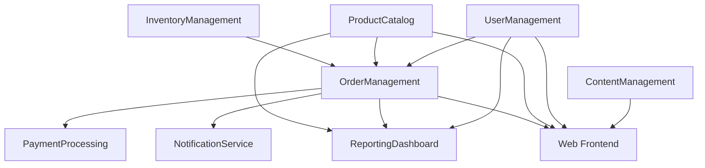

# Laravel Modular DDD Demo Application

This demo application showcases a complete e-commerce platform built using the Laravel Modular DDD package. It demonstrates how multiple modules work together to create a cohesive business application while maintaining clear boundaries and proper architectural patterns.

## 🏗️ Application Architecture

The demo application consists of several interconnected modules:

```
Demo E-Commerce Platform
├── UserManagement        # User authentication and profiles
├── ProductCatalog        # Product and category management
├── OrderManagement       # Order processing and fulfillment
├── InventoryManagement   # Stock tracking and management
├── PaymentProcessing     # Payment gateway integration
├── NotificationService   # Email and SMS notifications
├── ReportingDashboard    # Analytics and reporting
└── ContentManagement     # CMS for static content
```

## 🎯 Business Domain

**E-Commerce Platform Features:**
- User registration and authentication
- Product browsing and search
- Shopping cart functionality
- Order placement and tracking
- Payment processing
- Inventory management
- Notification system
- Admin dashboard with analytics

## 📦 Module Dependencies

The modules are designed with clear dependencies:



## 🚀 Quick Start

### 1. Prerequisites

- PHP 8.2 or higher
- Laravel 11.0 or higher
- MySQL 8.0+ or PostgreSQL 13+
- Redis (for caching and queues)
- Node.js 18+ (for frontend assets)

### 2. Installation

```bash
# Clone the repository
git clone https://github.com/tai-crm/laravel-modular-ddd.git
cd laravel-modular-ddd

# Install dependencies
composer install
npm install

# Copy environment file
cp .env.example .env

# Generate application key
php artisan key:generate

# Configure database and Redis in .env file
```

### 3. Database Setup

```bash
# Create database
mysql -u root -p -e "CREATE DATABASE laravel_modular_demo;"

# Run migrations
php artisan migrate

# Install demo modules
php artisan module:install UserManagement
php artisan module:install ProductCatalog
php artisan module:install OrderManagement
php artisan module:install InventoryManagement
php artisan module:install PaymentProcessing
php artisan module:install NotificationService
php artisan module:install ReportingDashboard
php artisan module:install ContentManagement

# Enable all modules
php artisan module:enable --all

# Run module migrations
php artisan module:migrate --all

# Seed demo data
php artisan module:seed --all
```

### 4. Frontend Setup

```bash
# Build frontend assets
npm run build

# Or for development
npm run dev
```

### 5. Start the Application

```bash
# Start Laravel development server
php artisan serve

# Start queue workers (in separate terminal)
php artisan queue:work

# Start scheduler (in separate terminal)
php artisan schedule:work
```

Visit http://localhost:8000 to see the demo application.

## 🧪 Demo Data

The application comes with comprehensive demo data:

### Users
- **Admin User**: admin@demo.com (password: admin123)
- **Customer Users**: customer1@demo.com, customer2@demo.com (password: password)
- **Merchant Users**: merchant@demo.com (password: merchant123)

### Products
- 50+ sample products across different categories
- Product images and detailed descriptions
- Various price ranges and attributes
- Stock levels and inventory tracking

### Orders
- Sample order history for demonstration
- Different order statuses (pending, processing, shipped, delivered)
- Payment records and transaction history

## 🔧 Configuration

### Module Configuration

Each module can be configured independently:

```bash
# Configure individual modules
php artisan vendor:publish --tag=user-management-config
php artisan vendor:publish --tag=product-catalog-config
php artisan vendor:publish --tag=order-management-config
```

### Environment Variables

Key environment variables for the demo:

```env
# Demo Application
DEMO_MODE=true
DEMO_DATA_SEEDING=true

# Module Configuration
USER_MANAGEMENT_ENABLED=true
PRODUCT_CATALOG_CACHE_TTL=3600
ORDER_MANAGEMENT_AUTO_FULFILL=false
PAYMENT_PROCESSING_SANDBOX=true
NOTIFICATION_SERVICE_QUEUE=redis

# External Services (Demo/Sandbox)
STRIPE_PUBLISHABLE_KEY=pk_test_...
STRIPE_SECRET_KEY=sk_test_...
MAILGUN_DOMAIN=sandbox.mailgun.org
MAILGUN_SECRET=key-...

# Performance Monitoring
MODULAR_DDD_MONITORING=true
MODULAR_DDD_PERFORMANCE_TRACKING=true
```

## 📊 Dashboard and Analytics

The demo includes a comprehensive dashboard:

### Admin Dashboard Features
- Real-time sales metrics
- Product performance analytics
- User activity monitoring
- Order fulfillment tracking
- Inventory level alerts
- Module health monitoring

### Merchant Dashboard Features
- Product management interface
- Order management tools
- Inventory tracking
- Sales analytics
- Customer insights

### Customer Features
- Product browsing and search
- Shopping cart and wishlist
- Order history and tracking
- Profile management
- Review and rating system

## 🛠️ Development Features

### Module Development Tools

```bash
# Generate new modules using the demo as template
php artisan module:make NewModule --template=demo

# Health monitoring
php artisan module:health --all

# Performance metrics
php artisan module:metrics --system

# Security scanning
php artisan module:security --scan --all

# Dependency visualization
php artisan module:visualize --format=html --output=dependencies.html
```

### Testing

```bash
# Run all tests
php artisan test

# Run module-specific tests
php artisan test modules/ProductCatalog/Tests
php artisan test modules/OrderManagement/Tests

# Run with coverage
php artisan test --coverage
```

### Development Workflow

```bash
# Enable development features
php artisan module:dev watch

# Generate development data
php artisan db:seed DemoDataSeeder

# Clear all caches during development
php artisan module:cache clear
php artisan optimize:clear
```

## 🔧 API Documentation

The demo application includes a comprehensive API:

### Authentication
```http
POST /api/auth/login
POST /api/auth/register
POST /api/auth/logout
GET  /api/auth/user
```

### Products
```http
GET    /api/products              # List products
GET    /api/products/{id}         # Get product details
POST   /api/products              # Create product (admin)
PUT    /api/products/{id}         # Update product (admin)
DELETE /api/products/{id}         # Delete product (admin)
GET    /api/products/search?q=... # Search products
```

### Orders
```http
GET    /api/orders                # List user orders
GET    /api/orders/{id}           # Get order details
POST   /api/orders                # Create order
PUT    /api/orders/{id}           # Update order
DELETE /api/orders/{id}           # Cancel order
```

### Shopping Cart
```http
GET    /api/cart                  # Get cart contents
POST   /api/cart/items            # Add item to cart
PUT    /api/cart/items/{id}       # Update cart item
DELETE /api/cart/items/{id}       # Remove cart item
POST   /api/cart/checkout         # Checkout cart
```

## 🧪 Testing the Demo

### Automated Testing

```bash
# Run integration tests across modules
php artisan test --testsuite=Integration

# Run feature tests for complete user journeys
php artisan test --testsuite=Feature

# Performance testing
php artisan test --testsuite=Performance
```

### Manual Testing Scenarios

1. **User Registration and Login**
   - Register new customer account
   - Email verification workflow
   - Password reset functionality

2. **Product Browsing**
   - Browse products by category
   - Use search functionality
   - Filter and sort products

3. **Shopping Cart**
   - Add products to cart
   - Update quantities
   - Apply discount codes

4. **Order Processing**
   - Complete checkout process
   - Payment processing
   - Order confirmation

5. **Admin Functions**
   - Manage products and inventory
   - Process orders
   - View analytics dashboard

## 📈 Performance Monitoring

The demo includes comprehensive monitoring:

### Metrics Collection
- Request/response times per module
- Database query performance
- Memory usage tracking
- Error rate monitoring
- User activity analytics

### Health Checks
```bash
# Check overall application health
php artisan module:health --all

# Monitor performance metrics
php artisan module:metrics --monitor

# Generate performance reports
php artisan module:metrics --report --output=performance-report.html
```

### Monitoring Dashboard
Access the monitoring dashboard at: http://localhost:8000/admin/monitoring

## 🔒 Security Features

### Authentication & Authorization
- JWT-based API authentication
- Role-based access control (RBAC)
- Permission-based resource access
- Rate limiting on API endpoints

### Security Scanning
```bash
# Run security scan on all modules
php artisan module:security --scan --all

# Generate security report
php artisan module:security --report --output=security-report.html
```

### Security Best Practices Demonstrated
- Input validation and sanitization
- SQL injection prevention
- XSS protection
- CSRF protection
- Secure password hashing
- API rate limiting

## 🚀 Deployment

### Production Deployment

```bash
# Optimize for production
php artisan optimize
php artisan module:cache rebuild
php artisan config:cache
php artisan route:cache
php artisan view:cache

# Run production health checks
php artisan module:health --all --production
```

### Docker Deployment

```bash
# Build and run with Docker
docker-compose up -d

# Run database migrations in container
docker-compose exec app php artisan migrate --force
docker-compose exec app php artisan module:migrate --all --force
```

## 🤝 Contributing

To contribute to the demo application:

1. Fork the repository
2. Create a feature branch
3. Add your module or enhancement
4. Ensure all tests pass
5. Submit a pull request

## 📚 Learning Resources

### Tutorials
- [Building Your First Module](../docs/tutorials/first-module.md)
- [Inter-Module Communication](../docs/tutorials/module-communication.md)
- [Testing Strategies](../docs/tutorials/testing-guide.md)

### Advanced Topics
- [Performance Optimization](../docs/advanced/performance.md)
- [Security Best Practices](../docs/advanced/security.md)
- [Deployment Strategies](../docs/advanced/deployment.md)

## 🆘 Support

For help with the demo application:

1. Check the [documentation](../docs/)
2. Review the [troubleshooting guide](../docs/troubleshooting.md)
3. Open an issue on [GitHub](https://github.com/tai-crm/laravel-modular-ddd/issues)
4. Join our [Discord community](https://discord.gg/laravel-modular-ddd)

---

This demo application provides a comprehensive example of building large-scale applications using modular DDD principles. It serves as both a learning resource and a starting point for your own projects.